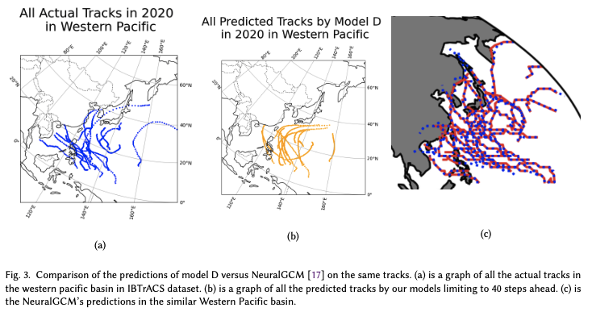

# An Investigative Comparison between SOTA NeuralGCM and LSTM RNNs for Cyclone Track Forecasting

### Abstract
Accurately predicting extreme weather events like cyclones is crucial for safeguarding lives and infrastructure. One standard modern approach to this problem deploys large weather models such as general circulation models. However, these are expensive to train and use even though they provide highly accurate inferences. Recent work has achieved a similar level of precision with machine learning techniques. However, these models are still considerably large-scale. In this paper, we examine the possibility of achieving comparable results using smaller-scale machine learning models. We have employed long short-term memory neural networks (LSTM) to predict tropical cyclone tracks by regarding them as time-series input data.

When compared to state-of-the-art computationally expensive forecasting models such as the Hurricane Analysis and Forecast System (HAFS), the accuracy of our model is respectable, with the absolute error being within 104\% for 12-hour-lead forecasts. Meanwhile, when compared to other modern deep learning approaches, our model appears to outperform more complicated deep learning-based models by an average of 147.5\% RMSE error. Our findings demonstrate that smaller-scale machine learning models, such as LSTMs, can provide competitive accuracy while significantly reducing computational costs. This suggests a promising avenue for more efficient and accessible cyclone forecasting, opening the door to broader applications in real-time weather prediction.

### More Information
To dive deeper into our research, read our research paper [here](report/An_Investigative_Comparison_between_State_of_the_art_NeuralGCM_and_Long_Short_Term_Memory_Recurrent_Neural_Network.pdf).